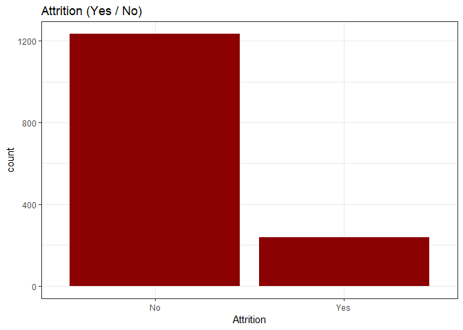
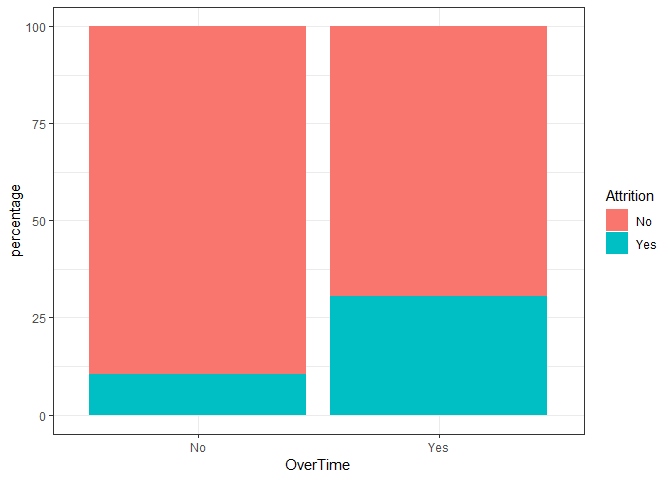
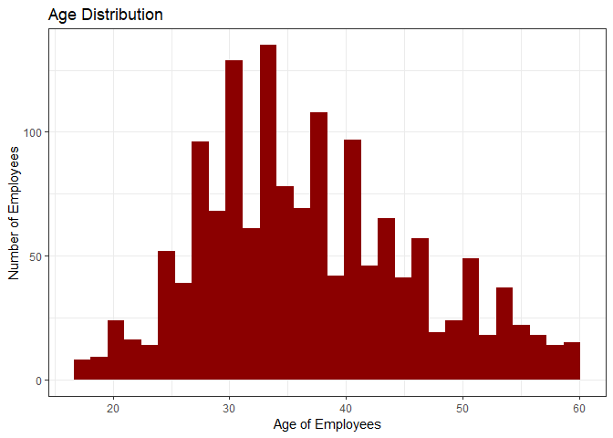
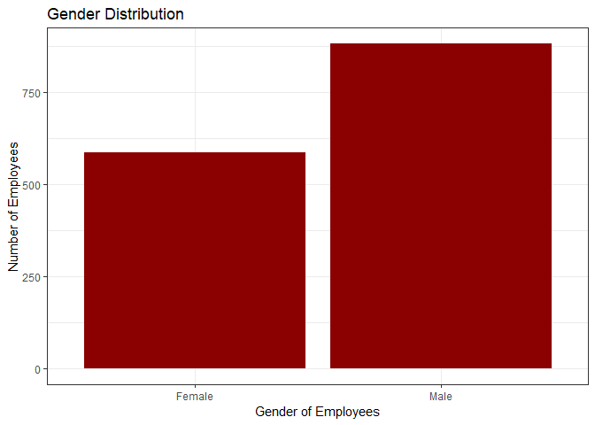

Descriptive Statistics
================


``` r
suppressPackageStartupMessages({
library(readxl)
library(stargazer)
library(MatchIt)
library(data.table)
library(tableone)
library(rbounds)
library(randomForest)
library(ggplot2)
library(ggthemes)
library(extrafont)
library(plyr)
library(scales)
library(dplyr)
library(tidyr)
library(keep)
})
```

#### Unit of Analysis: Employees

#### Treatment: Overtime (Y/N)

#### Outcome of Interest: Attrition (Y/N)

Loading the dataset and summarising features
============================================

``` r
hr <- read.csv('WA_Fn-UseC_-HR-Employee-Attrition.csv')
detach()
attach(hr)
#head(hr)
#colnames(hr)
#summary(hr)
str(hr)
```

    ## 'data.frame':    1470 obs. of  35 variables:
    ##  $ ï..Age                  : int  41 49 37 33 27 32 59 30 38 36 ...
    ##  $ Attrition               : Factor w/ 2 levels "No","Yes": 2 1 2 1 1 1 1 1 1 1 ...
    ##  $ BusinessTravel          : Factor w/ 3 levels "Non-Travel","Travel_Frequently",..: 3 2 3 2 3 2 3 3 2 3 ...
    ##  $ DailyRate               : int  1102 279 1373 1392 591 1005 1324 1358 216 1299 ...
    ##  $ Department              : Factor w/ 3 levels "Human Resources",..: 3 2 2 2 2 2 2 2 2 2 ...
    ##  $ DistanceFromHome        : int  1 8 2 3 2 2 3 24 23 27 ...
    ##  $ Education               : int  2 1 2 4 1 2 3 1 3 3 ...
    ##  $ EducationField          : Factor w/ 6 levels "Human Resources",..: 2 2 5 2 4 2 4 2 2 4 ...
    ##  $ EmployeeCount           : int  1 1 1 1 1 1 1 1 1 1 ...
    ##  $ EmployeeNumber          : int  1 2 4 5 7 8 10 11 12 13 ...
    ##  $ EnvironmentSatisfaction : int  2 3 4 4 1 4 3 4 4 3 ...
    ##  $ Gender                  : Factor w/ 2 levels "Female","Male": 1 2 2 1 2 2 1 2 2 2 ...
    ##  $ HourlyRate              : int  94 61 92 56 40 79 81 67 44 94 ...
    ##  $ JobInvolvement          : int  3 2 2 3 3 3 4 3 2 3 ...
    ##  $ JobLevel                : int  2 2 1 1 1 1 1 1 3 2 ...
    ##  $ JobRole                 : Factor w/ 9 levels "Healthcare Representative",..: 8 7 3 7 3 3 3 3 5 1 ...
    ##  $ JobSatisfaction         : int  4 2 3 3 2 4 1 3 3 3 ...
    ##  $ MaritalStatus           : Factor w/ 3 levels "Divorced","Married",..: 3 2 3 2 2 3 2 1 3 2 ...
    ##  $ MonthlyIncome           : int  5993 5130 2090 2909 3468 3068 2670 2693 9526 5237 ...
    ##  $ MonthlyRate             : int  19479 24907 2396 23159 16632 11864 9964 13335 8787 16577 ...
    ##  $ NumCompaniesWorked      : int  8 1 6 1 9 0 4 1 0 6 ...
    ##  $ Over18                  : Factor w/ 1 level "Y": 1 1 1 1 1 1 1 1 1 1 ...
    ##  $ OverTime                : Factor w/ 2 levels "No","Yes": 2 1 2 2 1 1 2 1 1 1 ...
    ##  $ PercentSalaryHike       : int  11 23 15 11 12 13 20 22 21 13 ...
    ##  $ PerformanceRating       : int  3 4 3 3 3 3 4 4 4 3 ...
    ##  $ RelationshipSatisfaction: int  1 4 2 3 4 3 1 2 2 2 ...
    ##  $ StandardHours           : int  80 80 80 80 80 80 80 80 80 80 ...
    ##  $ StockOptionLevel        : int  0 1 0 0 1 0 3 1 0 2 ...
    ##  $ TotalWorkingYears       : int  8 10 7 8 6 8 12 1 10 17 ...
    ##  $ TrainingTimesLastYear   : int  0 3 3 3 3 2 3 2 2 3 ...
    ##  $ WorkLifeBalance         : int  1 3 3 3 3 2 2 3 3 2 ...
    ##  $ YearsAtCompany          : int  6 10 0 8 2 7 1 1 9 7 ...
    ##  $ YearsInCurrentRole      : int  4 7 0 7 2 7 0 0 7 7 ...
    ##  $ YearsSinceLastPromotion : int  0 1 0 3 2 3 0 0 1 7 ...
    ##  $ YearsWithCurrManager    : int  5 7 0 0 2 6 0 0 8 7 ...

How many of the employees were treated / worked Overtime?
=========================================================

``` r
length(unique(hr$EmployeeNumber[hr$OverTime=='Yes']))
```

    ## [1] 416

How many of the employees did not work Overtime?
================================================

``` r
length(unique(hr$EmployeeNumber[hr$OverTime=='No']))
```

    ## [1] 1054

What percentage of the employees received the treatment / worked overtime?
==========================================================================

``` r
prop_overtime <- length(unique(hr$EmployeeNumber[hr$OverTime=='Yes'])) / length(unique(hr$EmployeeNumber[hr$OverTime=='No']))
round(prop_overtime * 100, digits=2)
```

    ## [1] 39.47

Plot showing the count of Employees working Overtime vs Not Overtime
====================================================================

``` r
ggplot(data=hr, aes(OverTime)) +
  theme_bw() +
  geom_bar(fill = "dark red") +
  ggtitle("Overtime (Yes / No)")
```


Plot showing the count of Employees Attrited vs Not Attrited
============================================================

``` r
ggplot(data=hr, aes(Attrition)) +
  theme_bw() +
  geom_bar(fill = "dark red") +
  ggtitle("Attrition (Yes / No)")
```



Count of Attrtition in employees who are working Overtime vs those who are not
==============================================================================

``` r
plt1 <- ggplot() +
  theme_bw() +
  geom_bar(aes(x = OverTime, y = Attrition, fill  = Attrition), data = hr, stat = "identity")
plt1
```


Percentage of Attrtition in employees who are working Overtime vs those who are not
===================================================================================

``` r
hr_sample <- hr %>% group_by(OverTime, Attrition) %>% dplyr::summarise(check1 = n()) %>% group_by(OverTime) %>%   mutate(check2 = sum(check1)) %>% ungroup() %>% mutate(percentage = round((check1/check2)*100, digits = 2))
```

    ## Warning: package 'bindrcpp' was built under R version 3.5.1

``` r
plt2 <- ggplot() +
  theme_bw() +
  geom_bar(aes(x = OverTime, y = percentage, fill  = Attrition), data = hr_sample, stat = "identity")
plt2
```



``` r
hr_sample <- ddply(hr_sample, .(OverTime), transform, pos = (0.5 * percentage))
fill <- c("#40b8d0", "#b2d183")
plt2 <- plt2 +
  geom_text(data=hr_sample, aes(x = OverTime, y = pos, label = paste0(percentage,"%")), size=4) +
  scale_fill_manual(values=fill) +
  xlab("Overtime (Yes / No)") + ylab("Employee Attrition (%)") +
  ggtitle("Attrition(%) in Overtime vs Non-Overtime Employees")
plt2
```


Univariate Analysis
===================

Looking at the numeric variables
--------------------------------

``` r
ggplot(data=hr, aes(ï..Age)) + 
  theme_bw() +
  xlab("Age of Employees") + ylab("Number of Employees") +
  geom_histogram(fill = "dark red") +
  ggtitle("Age Distribution")
```

    ## `stat_bin()` using `bins = 30`. Pick better value with `binwidth`.



Distribution of Employees by Gender
-----------------------------------

``` r
(length(unique(hr$EmployeeNumber[hr$Gender=='Male'])) / length(unique(hr$EmployeeNumber))) * 100
```

    ## [1] 60

``` r
ggplot(data=hr, aes(Gender)) + 
  theme_bw() +
  xlab("Gender of Employees") + ylab("Number of Employees") +
  geom_histogram(stat = 'count',fill = "dark red") +
  ggtitle("Gender Distribution")
```

    ## Warning: Ignoring unknown parameters: binwidth, bins, pad



``` r
hr[c('DailyRate', 'DistanceFromHome', 'ï..Age', 'HourlyRate', 'MonthlyIncome','NumCompaniesWorked')] %>%
  select_if(is.numeric) %>%
  gather() %>%                             
  ggplot(aes(x = value)) +
  theme_bw() +
  facet_wrap(~ key, scales = "free") +  
  geom_histogram(fill = "dark red")
```

    ## `stat_bin()` using `bins = 30`. Pick better value with `binwidth`.


``` r
hr[c('PercentSalaryHike', 'TotalWorkingYears', 'YearsAtCompany', 'YearsInCurrentRole', 'YearsSinceLastPromotion', 'YearsWithCurrManager')] %>%
  select_if(is.numeric) %>%
  gather() %>%                             
  ggplot(aes(x = value)) +
  theme_bw() +
  facet_wrap(~ key, scales = "free") +  
  geom_histogram(fill = "dark red")
```

    ## `stat_bin()` using `bins = 30`. Pick better value with `binwidth`.


